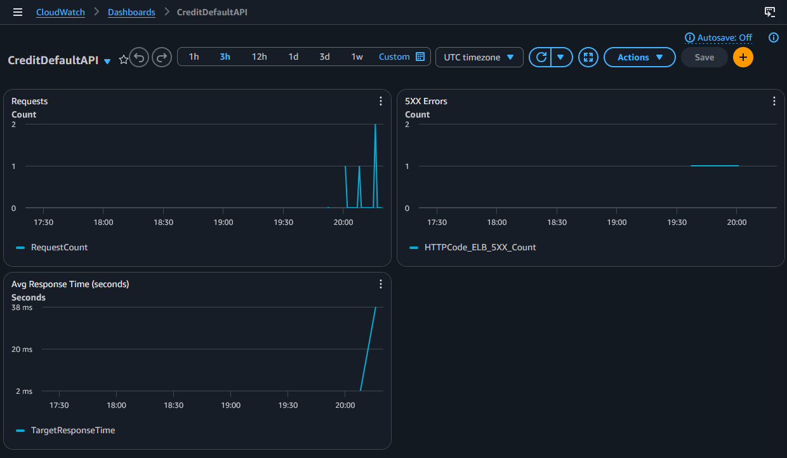

# Credit Default Prediction Pipeline

End-to-end machine learning project predicting credit card defaults using the UCI Taiwan Credit Card dataset.

## Problem Statement

Given a credit card holder's demographic data, payment history, and credit history, predict whether they will default on their next payment.

This binary classification problem is critical for financial institutions: false negatives cost the lender money, false positives alienate good customers.

## Dataset

- **Source**: UCI Machine Learning Repository (Taiwan Credit Card Default)
- **Records**: 30,000 credit card clients
- **Features**: 23 original numeric/categorical features (credit limit, sex, education, marital status, age, payment statuses, bill amounts, pay amounts)
- **Target**: Default payment next month (0 = no, 1 = yes)
- **Imbalance**: ~22% default rate

## Project Structure

```
credit-default-pipeline/
├── data/
│   ├── raw/            # Original Excel file
│   └── processed/      # Generated EDA and evaluation plots
├── notebooks/
│   ├── 01_initial_eda.ipynb   # First data exploration
│   └── 02_deep_eda.ipynb      # Comprehensive EDA with visualisations
├── src/
│   ├── data/
│   │   └── preprocess.py      # Data cleaning and renaming
│   ├── features/
│   │   └── build_features.py  # Feature engineering, scaling, SMOTE, splits
│   ├── models/
│   │   ├── train_baseline.py  # Baseline, Logistic Regression, Decision Tree
│   │   ├── train_advanced.py  # Random Forest, XGBoost
│   │   ├── tune_model.py      # Hyperparameter tuning (RandomizedSearchCV)
│   │   └── final_evaluation.py # Test set evaluation & cost-benefit analysis
│   └── api/
│       └── main.py            # FastAPI prediction endpoint
├── dashboard/
│   └── app.py                 # Streamlit interactive dashboard
├── tests/                     # pytest unit tests for all modules
├── models/                    # Serialised model, scaler, and model card
├── requirements.txt
├── Dockerfile
└── README.md
```

## Key Results

| Metric        | Validation Set | Held-out Test Set |
|---------------|----------------|-------------------|
| Accuracy      | 80.7%          | 80.0%             |
| Precision (1) | 0.594          | 0.57              |
| Recall (1)    | 0.408          | 0.42              |
| F1-Score (1)  | 0.483          | 0.48              |
| ROC-AUC       | 0.7597         | 0.7536            |

### Cost-Benefit Analysis

Assumptions: False Negative = €5,000 cost, False Positive = €1,000 cost.

- No model (accept all): €4,975,000 loss on test set
- Model: €3,219,000 loss
- **Savings: 35.3% reduction in expected cost**

## How to Run

1. **Clone the repository**:

   ```bash
   git clone <your-repo-url>
   cd credit-default-pipeline
   ```

2. **Install dependencies**:

   ```bash
   python -m pip install -r requirements.txt
   ```

3. **Train the final model** (optional if models are already included):

   ```bash
   python -m src.models.final_evaluation
   ```

4. **Start the REST API**:

   ```bash
   uvicorn src.api.main:app --reload
   ```

   Open `http://127.0.0.1:8000/docs` for the Swagger UI.

5. **Launch the dashboard**:

   ```bash
   streamlit run dashboard/app.py
   ```

## Live Deployment

| Service                   | URL                                                                                                                                                                   |
|---------------------------|-----------------------------------------------------------------------------------------------------------------------------------------------------------------------|
| **REST API (Swagger UI)** | [https://credit-default-api-y97j.onrender.com/docs](https://credit-default-api-y97j.onrender.com/docs)                                                               |
| **Interactive Dashboard** | [https://credit-default-pipeline-n6gmizwwshmywhfcaqeznd.streamlit.app](https://credit-default-pipeline-n6gmizwwshmywhfcaqeznd.streamlit.app)                         |

> The API is hosted on Render (free tier) and may take 30–50 seconds to start after inactivity. The dashboard is on Streamlit Cloud.

## AWS Deployment (Infrastructure as Code + CI/CD)

The same API is also deployed on **AWS ECS Fargate** using Terraform, with a fully automated GitHub Actions pipeline — demonstrating production cloud skills.

### Live AWS Endpoint

- **Health check:** [http://credit-default-dev-469151438.eu-north-1.elb.amazonaws.com/health](http://credit-default-dev-469151438.eu-north-1.elb.amazonaws.com/health)
- **Swagger UI:** [http://credit-default-dev-469151438.eu-north-1.elb.amazonaws.com/docs](http://credit-default-dev-469151438.eu-north-1.elb.amazonaws.com/docs)

### Architecture

- **Compute**: ECS Fargate (serverless containers)
- **Load Balancer**: Application Load Balancer (ALB) in public subnets
- **Networking**: VPC with public/private subnets, NAT Gateways, Internet Gateway
- **Container Registry**: Amazon ECR
- **Model Storage**: S3 bucket (versioned, encrypted, private)
- **Logging & Monitoring**: CloudWatch Logs and CloudWatch Dashboard
- **Infrastructure as Code**: Terraform (modular: `vpc`, `ecs`, `ecr`, `s3`, `iam`, `security_groups`)
- **CI/CD**: GitHub Actions builds Docker image, pushes to ECR, and deploys to ECS on every push to `master`

### Monitoring Dashboard



A CloudWatch dashboard named **`CreditDefaultAPI`** displays request count, 5XX errors, and average response time.

### Cost

Approximately **$15–20/month** (NAT Gateway + Fargate). With AWS Free Tier credits, initial months cost $0. A billing alarm is configured at $5/month.

### Deployment Steps (for a fresh AWS account)

1. Clone the repo and set up AWS credentials (`aws configure`).
2. Manually create a Terraform state backend (S3 bucket + DynamoDB lock table).
3. `cd terraform && terraform init && terraform apply`
4. Upload model artifacts to the S3 bucket.
5. Build and push the Docker image to ECR (or let CI/CD do it).
6. Add GitHub Secrets (`AWS_ACCESS_KEY_ID`, `AWS_SECRET_ACCESS_KEY`, `AWS_REGION`) for CI/CD.
7. Push to `master` — GitHub Actions deploys automatically.

### Cleanup

```bash
cd terraform && terraform destroy
```

## Monitoring & Explainability

- **Data Drift Report**: [View latest drift analysis](https://htmlpreview.github.io/?https://raw.githubusercontent.com/SJKantola/credit-default-pipeline/master/data/processed/drift_report.html) (Evidently AI)
- **Model Explainability**: The [live dashboard](https://credit-default-pipeline-n6gmizwwshmywhfcaqeznd.streamlit.app) includes a **SHAP explainability tab** showing how each feature contributes to an individual prediction.
- **CI/CD**: Every push runs the test suite automatically via [GitHub Actions](https://github.com/SJKantola/credit-default-pipeline/actions)

## Testing

```bash
python -m pytest tests/ -v
```

## Technologies

- Python, pandas, numpy
- scikit-learn, XGBoost, imbalanced-learn (SMOTE)
- FastAPI, Pydantic
- Streamlit
- matplotlib, seaborn
- pytest
- Docker, Render, Streamlit Cloud
- Evidently AI, SHAP
- Git, GitHub Actions (CI/CD)
- Terraform, AWS (ECS Fargate, S3, ECR, CloudWatch, IAM)

## Author

S.J. Kantola  
[LinkedIn](https://www.linkedin.com/in/s-j-kantola-76747a269/) · [GitHub](https://github.com/SJKantola)
